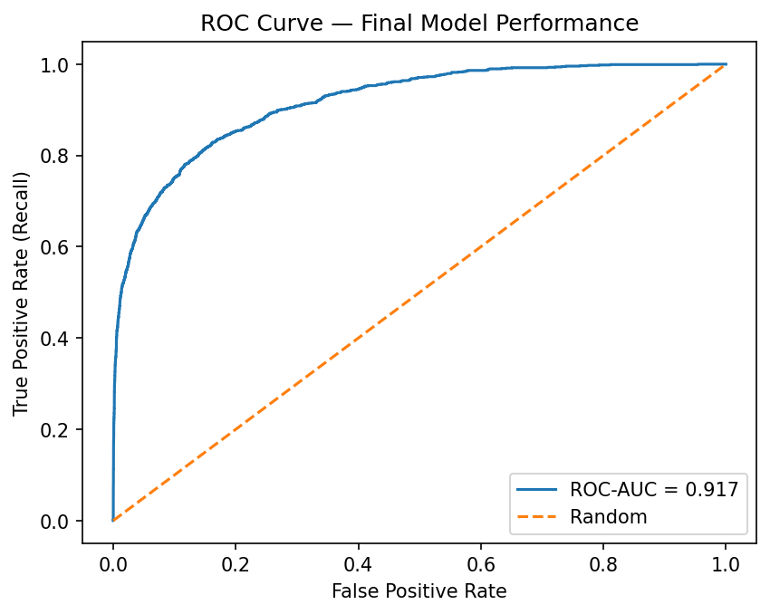
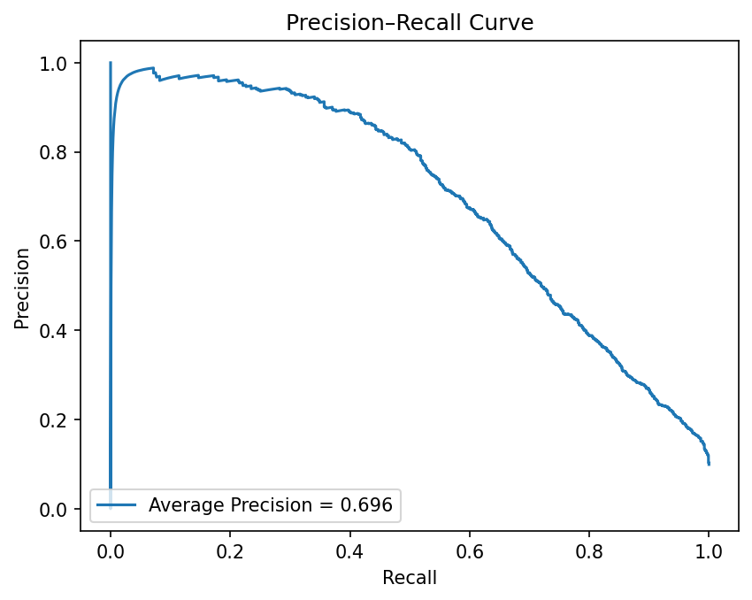
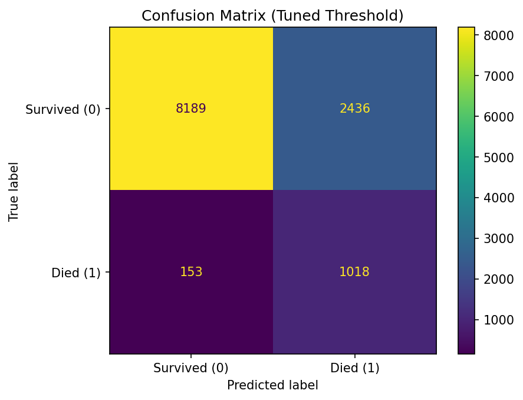
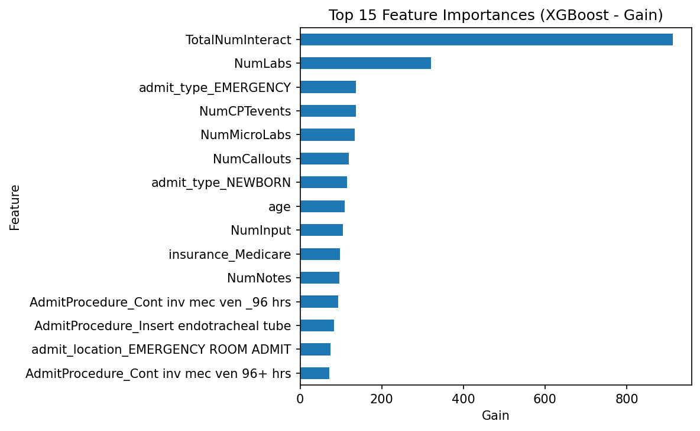

```
╔══════════════════════════════════════════════════════════════════╗
║                                                                  ║
║   ICU MORTALITY RISK PREDICTION                                  ║
║   Early Identification of High-Risk Patients                     ║
║   Using Structured EHR Clinical Data                             ║
║                                                                  ║
╚══════════════════════════════════════════════════════════════════╝
```

[](https://www.kaggle.com/datasets/drscarlat/mimic3c)
[](https://python.org)
[](https://xgboost.readthedocs.io/)
[](https://icu-mortality-risk-prediction-ldqgvlkdtpd9btbdkxxak3.streamlit.app/)
[](https://github.com/KrishnaKJoshi1/icu-mortality-risk-prediction)

XGBoost pipeline trained on MIMIC-III ICU data — ROC-AUC 0.90, Recall ≥ 0.85 after threshold tuning — deployed as a live Streamlit application for real-time patient risk scoring.

---

## The Question

In the intensive care unit, every hour matters. Clinicians manage dozens of patients simultaneously, and identifying which patients are at highest risk of dying — before obvious deterioration occurs — is one of the hardest challenges in critical care.

This project asks: **can structured EHR data available at admission predict in-hospital mortality with enough accuracy to support early clinical intervention?**

The answer: yes — with a recall-optimized XGBoost pipeline achieving **ROC-AUC 0.90** and **Recall ≥ 0.85** after threshold tuning.

---

## Live Application Demo

Explore the deployed interactive application:

🔗 [Launch Live App](https://icu-mortality-risk-prediction-ldqgvlkdtpd9btbdkxxak3.streamlit.app/)

The Streamlit interface enables:

- Patient record selection by row index
- Real-time mortality risk prediction
- Probability risk scoring (0.000 – 1.000)
- Color-coded triage classification:
  - 🟢 Low Risk — standard monitoring
  - 🟡 Moderate Risk — increase observation
  - 🔴 Elevated Risk — clinical review
  - 🔴 Critical Risk — immediate attention required


---

## Dataset

This project uses an aggregated ICU clinical dataset derived from MIMIC-III electronic health records.

The full dataset is **not included** in this repository due to data usage agreements.

To reproduce locally:

1. Download the dataset from Kaggle
2. Place the file as `mimic3c.csv` in the project root directory
3. Update file paths if needed

Dataset Source:
https://www.kaggle.com/datasets/drscarlat/mimic3c

---

## Modeling Pipeline

```
MIMIC-III (mimic3c.csv)
        │
        ▼
EDA & Exploratory Analysis
(distributions · missing values · correlations · class imbalance)
        │
        ▼
Feature Engineering
(median imputation · one-hot encoding · standard scaling)
        │
        ▼
Train / Test Split  ──  80% train · 20% test · stratified on target
        │
        ▼
     Model Stack
  ┌─────────────────────────────────────────┐
  │  Logistic Regression  (baseline)        │
  │  Random Forest        (ensemble)        │
  │  XGBoost ★            (selected model)  │
  └─────────────────────────────────────────┘
        │
        ▼
Evaluation  ──  Recall · ROC-AUC · AUPRC · Threshold Tuning
        │
        ▼
pipeline.pkl  ──  Deployment Artifact
        │
        ▼
Streamlit App  ──  Live Patient Risk Scoring
```

---

## Model Performance

| Model | Recall | ROC-AUC | Notes |
|---|---|---|---|
| **XGBoost** | **≥ 0.85** | **0.90** | **Selected — best Recall + AUC** |
| Random Forest | lower | strong | Ensemble baseline |
| Logistic Regression | lowest | moderate | Linear baseline |

> **Why Recall?** In ICU mortality prediction, a missed high-risk patient (false negative) carries far greater clinical cost than a false alarm. Recall was chosen as the primary metric to minimize missed detections. Threshold was tuned to target Recall ≥ 0.85.





---

## Threshold Tuning

Default model predictions use a 0.5 cutoff. For ICU risk prediction, the decision threshold was tuned to reach a minimum Recall of **0.85**, reducing false negatives.

| Threshold | Recall | Precision | Clinical implication |
|---|---|---|---|
| 0.50 | lower | higher | More conservative — misses more high-risk patients |
| **0.30** | **≥ 0.85** | **moderate** | **Operating point — chosen for patient safety** |
| 0.20 | highest | lower | Too many false alarms |

At threshold 0.30, the model flags the majority of high-risk patients correctly, accepting some false alarms as the clinical cost of not missing critical cases.



---

## Top Predictive Features — XGBoost

| Rank | Feature | Clinical meaning |
|---|---|---|
| 1 | `TotalNumInteract` | Total clinical interactions — strongest overall severity signal |
| 2 | `NumLabs` | Lab order volume — active investigation intensity |
| 3 | `NumCallouts` | Number of care escalation callouts |
| 4 | `NumMicroLabs` | Microbiology lab orders — infection and sepsis indicator |
| 5 | `NumCPTevents` | Procedure count — proxy for illness complexity |
| 6 | `age` | Older patients carry higher baseline mortality risk |
| 7 | `NumInput` | Fluid and medication inputs — critical care intensity |
| 8 | `admit_type_EMERGENCY` | Emergency admission — higher acuity on arrival |
| 9 | `AdmitProcedure: Tracheostomy` | Airway intervention — severe respiratory compromise |
| 10 | `admit_type_ELECTIVE` | Elective admission — lower baseline acuity (protective signal) |
| 11 | `insurance_Medicare` | Medicare patients tend to be older with more comorbidities |
| 12 | `admit_location_EMERGENCY ROOM` | ER arrival — unplanned, higher severity |
| 13 | `AdmitProcedure: Intubation` | Endotracheal intubation — critical respiratory failure |
| 14 | `NumRx` | Medication count — polypharmacy as severity proxy |
| 15 | `AdmitProcedure: Mech vent <96h` | Short-term mechanical ventilation — acute respiratory intervention |

*Full chart available in `notebooks/04_model_evaluation.ipynb`.*



---

## Bias & Fairness Analysis

The model was audited across patient subgroups to check for performance disparities — a critical step for any clinical AI system.

Groups evaluated:

- **Age:** Under 40 / 40–60 / 60–75 / Over 75
- **Gender:** M / F
- **Insurance type:** Medicare / Medicaid / Private / Government / Self-pay

Any group with Recall below 0.70 was flagged as a concern requiring investigation before clinical use.

Full results in `notebooks/05_bias_analysis.ipynb`.

---

## Repository Structure

```
icu-mortality-risk-prediction/
│
├── app/
│   └── streamlit_app.py          ← interactive patient risk scoring app
│
├── artifacts/
│   └── pipeline.pkl              ← trained preprocessing + XGBoost pipeline
│
├── demo_data/
│   └── patients_demo_500.csv     ← 500 sample records for demo use
│
├── images/
│   ├── streamlit_demo.png
│   ├── roc_curve.png
│   ├── precision_recall_curve.png
│   ├── confusion_matrix.png
│   ├── feature_importance.png
│   └── mortality_distribution.png
│
├── notebooks/
│   ├── 01_data_loading_and_eda.ipynb
│   ├── 02_feature_engineering.ipynb
│   ├── 03_model_training.ipynb
│   ├── 04_model_evaluation.ipynb
│   └── 05_bias_analysis.ipynb
│
├── README.md
├── requirements.txt
└── runtime.txt
```

---

## Run Locally

```bash
# Install dependencies
pip install -r requirements.txt

# Run the Streamlit app
streamlit run app/streamlit_app.py
```

---

## Clinical Relevance

Early mortality risk identification supports:

- ICU triage prioritization
- Monitoring escalation decisions
- Resource allocation planning
- Critical care intervention timing

The recall-optimized modeling strategy aligns with patient-safety-focused healthcare AI deployment principles.

---

## Limitations

- Dataset sourced from a single institution (Beth Israel Deaconess, Boston) — results may not generalise to other hospital systems
- Model is intended to support clinical decision-making, not replace it
- SHAP-based interpretability was explored but excluded due to environment compatibility — planned for a future version
- Bias analysis is descriptive; formal statistical testing recommended before clinical use

---

## Future Enhancements

- Time-series ICU modeling with hourly vitals
- SHAP-based explainability integration
- Survival analysis (time-to-event modeling)
- Real-time EHR connectivity
- External validation on MIMIC-IV or eICU-CRD

---

## Tech Stack

| Layer | Technology |
|---|---|
| Data | MIMIC-III (Kaggle / PhysioNet) |
| Language | Python 3.8 |
| ML | scikit-learn, XGBoost, pandas, NumPy, joblib |
| Visualisation | matplotlib, seaborn |
| Deployment | Streamlit |

---

## Citation

```
@misc{icu_mortality_joshi_2025,
  title  = {ICU Mortality Risk Prediction Using Structured EHR Data},
  author = {Joshi, Krishna K.},
  year   = {2025},
  note   = {Healthcare ML Portfolio Project — MIMIC-III},
  url    = {https://github.com/KrishnaKJoshi1/icu-mortality-risk-prediction}
}
```

---

Healthcare Machine Learning Portfolio Project
Focused on predictive analytics, clinical AI modeling, and deployment-ready healthcare ML systems.
