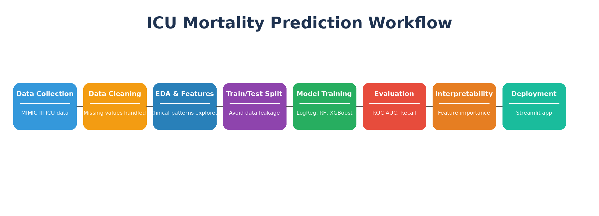
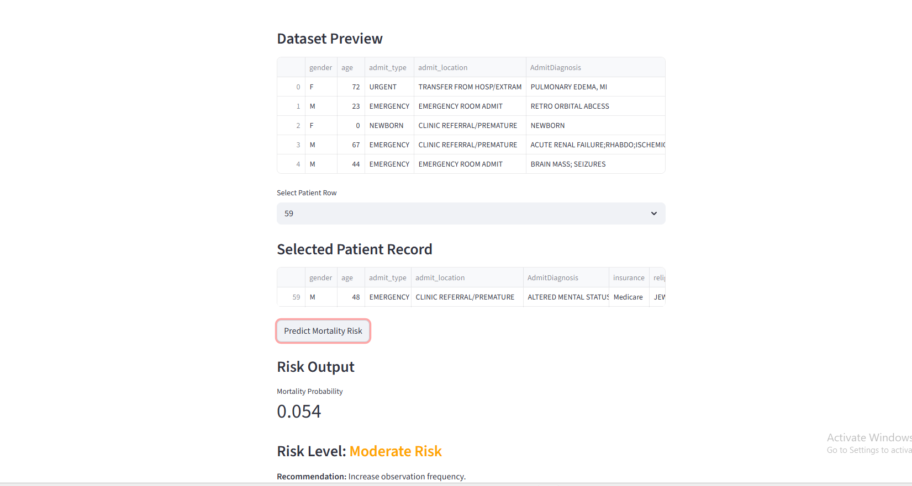
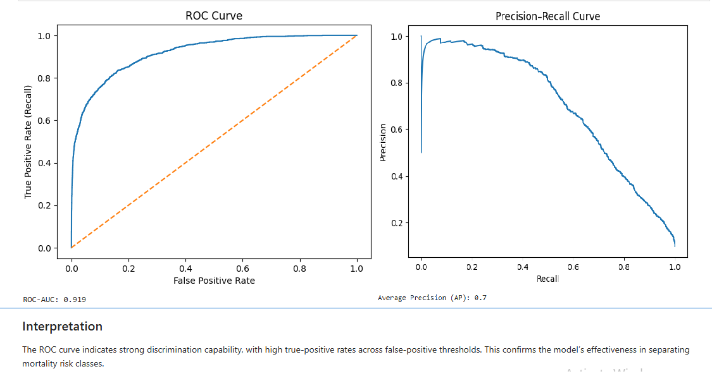

# ICU Mortality Risk Prediction — Healthcare Machine Learning Project

An end-to-end machine learning system designed to predict patient mortality risk in Intensive Care Unit (ICU) settings using structured Electronic Health Record (EHR) data.

The solution focuses on early identification of high-risk patients and safety-aligned predictive modeling to support critical care decision-making.

---

## Problem Context

In ICU environments, delayed recognition of deteriorating patients can significantly impact survival outcomes.

This project addresses that challenge by developing a predictive risk modeling framework capable of identifying high-mortality-risk patients early using structured clinical variables.

The system is designed with a patient-safety-first evaluation strategy.

---

## Project Workflow

  

This workflow summarizes the end-to-end pipeline used in this project, from ICU data preprocessing to model evaluation, interpretability, and deployment.

----

## Dataset

This project uses an aggregated ICU clinical dataset derived from MIMIC-III electronic health records.

Due to data usage and repository size considerations, the full dataset is **not included** in this repository.

To reproduce the notebook locally:

1. Download the dataset from Kaggle  
2. Place the file as `mimic3c.csv` in the project root directory  
3. Update file paths if needed

Dataset Source:  
https://www.kaggle.com/datasets/drscarlat/mimic3c

---

## Live Application Demo

Explore the deployed interactive application:

🔗 **Launch the App:**  
https://icu-mortality-risk-prediction-yf8edp6nshnkynwdpabtex.streamlit.app/

The Streamlit interface enables:

- Patient record selection
- Real-time mortality prediction
- Probability risk scoring
- Color-coded triage classification

---
## Modeling Approach

Multiple supervised learning models were trained and evaluated:

- Logistic Regression (Baseline)
- Random Forest
- XGBoost — Final Selected Model

Key modeling steps:

- Clinical feature preprocessing
- Missing value handling
- Encoding & scaling
- Class imbalance consideration
- Cross-model comparison

Model selection prioritized **Recall** to minimize false negatives — aligning with ICU risk detection priorities.

---

## Model Performance & Outcomes

Performance evaluation included:

- Recall-focused comparison
- ROC-AUC discrimination
- Precision–Recall tradeoff
- Confusion matrix interpretation
- Threshold tuning validation

The final XGBoost model achieved strong predictive performance, with ROC-AUC of 0.90 and Recall exceeding 0.85 after threshold tuning. This operating point prioritizes high-risk patient detection while maintaining acceptable precision.

---

## Deployment Pipeline

A production-ready pipeline was constructed integrating:

- Data preprocessing
- Feature encoding
- Scaling transformations
- XGBoost inference

The serialized pipeline artifact ensures consistent transformation logic and reproducible predictions during deployment.

---

## Clinical Relevance

Early mortality risk identification supports:

- ICU triage prioritization
- Monitoring escalation decisions
- Resource allocation planning
- Critical care intervention timing

The recall-optimized modeling strategy aligns with patient-safety-focused healthcare AI deployment principles.
---
## Run Locally

Install dependencies:

pip install -r requirements.txt

Run the Streamlit app:

streamlit run app/streamlit_app.py

---

## Technology Stack

- Python
- Pandas & NumPy
- Scikit-learn
- XGBoost
- Matplotlib
- Streamlit
- Joblib

---

## Future Enhancements

Potential extensions include:

- Time-series ICU modeling
- Survival analysis integration
- Real-time EHR connectivity
- Cloud-scale deployment architecture

---

## Author

Healthcare Machine Learning Portfolio Project  
Focused on predictive analytics, clinical AI modeling, and deployment-ready healthcare ML systems.

